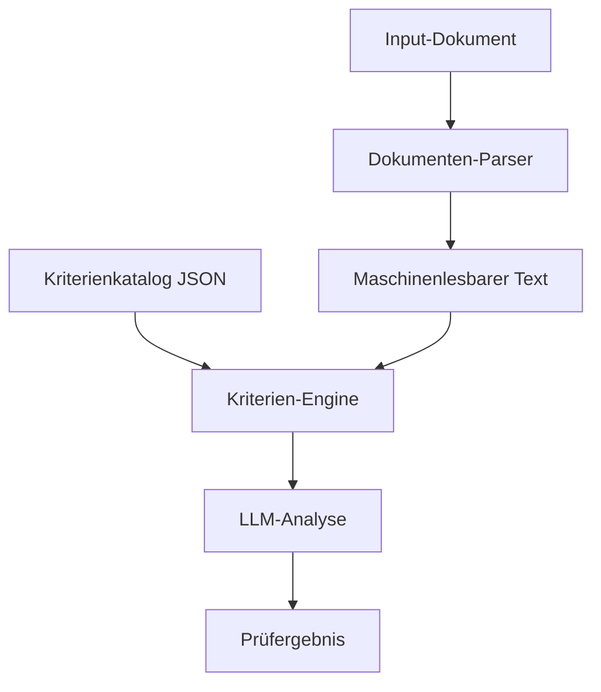

# Dokumentenprüfsystem - Prozessbeschreibung

## 🎯 Überblick

Das System dient der automatisierten Prüfung von Förderanträgen mittels LLM-basierter Dokumentenanalyse. Der Prozess basiert auf zwei Hauptkomponenten:

1. **Input-Dokumente** (Antragsunterlagen)
2. **Kriterienkatalog** (JSON-Konfiguration)

## 📑 Prozessablauf



### 1. Input-Verarbeitung
- Unterstützte Formate: PDF, DOCX, etc.
- Dokumente werden geparst und in maschinenlesbaren Text umgewandelt
- Jedes Dokument kann mehrere Kriterien haben

### 2. Kriterienkatalog (JSON)
Jedes Kriterium definiert sich durch:
- **Name**: Bezeichnung des Kriteriums
- **Ziel**: Zu erreichender Sollwert/Bedingung
- **Prompt**: LLM-Anweisung zur Prüfung
- **Erwartetes Ergebnis**: Format der Antwort (Boolean/Integer/Text)

### 3. Prüfungsprozess
1. **Dokumentenauswahl**: Ein Dokument wird zur Prüfung ausgewählt
2. **Kriterienermittlung**: Zugehörige Kriterien werden aus JSON geladen
3. **Sequenzielle Prüfung**: Jedes Kriterium wird einzeln geprüft
4. **LLM-Analyse**: 
   - Dokument + Kriterium -> LLM
   - LLM fungiert in definierter Rolle (z.B. Finanzberater)
   - Strukturierte Antwort wird generiert
5. **Ergebniserfassung**: Prüfergebnis wird im definierten Format gespeichert

## 🔧 Technische Umsetzung

### Dokumenten-Pipeline
```python
class DocumentProcessor:
    def parse_document(self, file_path: str) -> str:
        """Konvertiert Dokument in maschinenlesbaren Text"""
        pass

class CriteriaEngine:
    def load_criteria(self, document_type: str) -> List[Criterion]:
        """Lädt relevante Kriterien aus JSON"""
        pass
        
    def evaluate_criterion(self, 
        document_text: str, 
        criterion: Criterion,
        llm: LLMInterface
    ) -> CriterionResult:
        """Prüft ein Kriterium mittels LLM"""
        pass
```

### JSON-Struktur
```json
{
  "documents": [
    {
      "type": "business_plan",
      "supported_formats": ["pdf", "docx"],
      "criteria": [
        {
          "name": "Eigenkapital",
          "description": "Prüfung der Eigenkapitalausstattung",
          "target": {
            "type": "number",
            "min": 10000
          },
          "prompt": {
            "role": "Finanzberater",
            "instruction": "Analysiere das Eigenkapital...",
            "expected_format": "number"
          }
        }
      ]
    }
  ]
}
```

## 🎨 UI-Integration

Die Konfiguration wird später über eine UI pflegbar sein:
- Dokumente hinzufügen/bearbeiten
- Kriterien definieren
- Prompts anpassen
- Zielwerte setzen

## 📊 Ergebnis-Handling

Prüfergebnisse werden strukturiert gespeichert:
```json
{
  "document_id": "doc_123",
  "criteria_results": [
    {
      "criterion_name": "Eigenkapital",
      "result": 50000,
      "passed": true,
      "timestamp": "2025-11-08T10:00:00Z"
    }
  ]
}
```

## 🔄 Erweiterbarkeit

Das System ist erweiterbar für:
- Neue Dokumententypen
- Zusätzliche Kriterien
- Angepasste Prompts
- Verschiedene LLM-Modelle